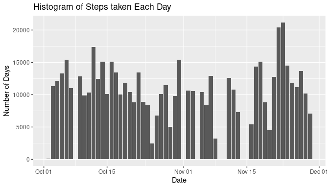
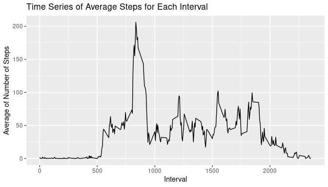
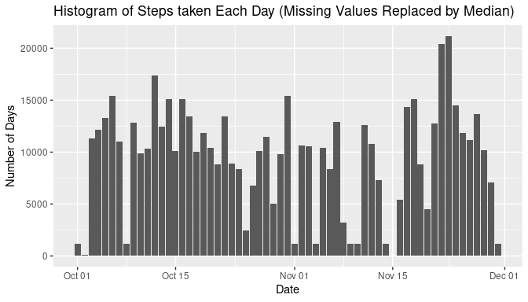
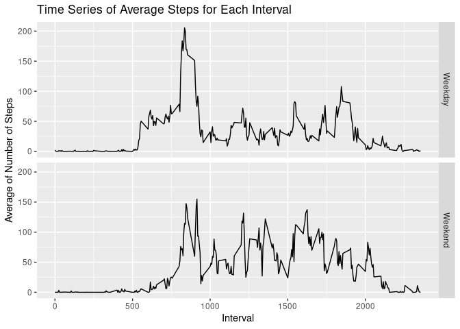

## Loading and preprocessing the data
Read the data from csv file, if file does not exist check for zipped file and 
extract it and if zipped file also does not exist then download it.

```r
##  check if data exists, if does not then download it
## download date "4 September 2020"
if(!file.exists("./activity.csv")){
  if(!file.exists("./activity.zip")){
    download.file("https://d396qusza40orc.cloudfront.net/repdata%2Fdata%2Factivity.zip",
                  destfile = "./activity.zip")
  }
  unzip("./activity.zip")
}
activitydata <- read.csv("activity.csv", 
                         header = T,
                         na.strings = "NA",
                         colClasses = c("numeric", "character", "numeric"),
                         )
activitydata$date <- as.Date(activitydata$date, format = "%Y-%m-%d")
activitydata <- dplyr::as_tibble(activitydata)
```

## What is mean total number of steps taken per day?
First calculating the number of steps taken each day. The sum for dates with 
missing value will be NA. First we will draw histogram of step per day.

```r
library(dplyr)
library(ggplot2)
data <- group_by(activitydata,date)
data <- summarise(data,sum(steps))
colnames(data)<- c("date", "sums")
ggplot(data, aes(date, sums)) +
  geom_bar(stat = 'identity') +
  labs(title ="Histogram of Steps taken Each Day" ,x = "Date", y = "Number of Days")
```

<!-- -->
  
Now calculating the mean and median of number of steps per day.


```r
cat("Mean :" ,mean(data$sums, na.rm = T))
cat(" Median :", median(data$sums, na.rm = T))
```

```
## Mean : 10766.19 Median : 10765
```

## What is the average daily activity pattern?
First calculate the average number of steps taken per interval after removing NA
values. Plot the time series graph of interval vs avg number of steps taken.  
Find out the interval with maximum average number of steps taken.  

```r
data1 <- group_by(activitydata,interval) %>% filter(!is.na(steps))
data1<- summarise(data1,mean(steps))
colnames(data1)<- c("interval", "average")
ggplot(data1, aes(interval,average )) + 
  geom_line(stat = "identity") +
  labs(title ="Time Series of Average Steps for Each Interval" ,
       x = "Interval", y = "Average of Number of Steps")
maximum <- data1$interval[which.max(data1$average)]
paste("Interval with maximum average number of steps taken is ", maximum)
```

```
## [1] "Interval with maximum average number of steps taken is  835"
```

<!-- -->

## Imputing missing values
First calculate the number of missing values. Then calculate the median of number 
of steps each interval. Then replace the missing values with median of that interval.  
Then plot the histogram for the number of steps taken each day and calculate the
mean and median after imputing missing values.


```r
data2<- activitydata
missing_values <- nrow(filter(data2,is.na(steps)))
paste("Total Number of Missing values is ", missing_values)
#Replace the missing values by median
tempdata <- group_by(activitydata,interval) %>% filter(!is.na(steps))
tempdata <- summarise(tempdata, median(steps))
colnames(tempdata) <- c("interval", "med")
na_indexs <- which(is.na(data2))
for(i in na_indexs){
  data2$steps[i] <- tempdata$med[tempdata$interval == data2$interval[i]]
}

data3 <- data2 
#calculate the mean for each day
data3 <- group_by(data3,date)
data3 <- summarise(data3,sum(steps))
colnames(data3)<- c("date", "sums")
ggplot(data3, aes(date, sums)) +
  geom_bar(stat = 'identity') +
  labs(title ="Histogram of Steps taken Each Day (Missing Values Replaced by Median)" 
       ,x = "Date", y = "Number of Days")
total_mean <-mean(data3$sums, na.rm = T)
total_median <- median(data3$sums, na.rm = T)
cat("Mean :" ,mean(data3$sums, na.rm = T))
cat(" Median :", median(data3$sums, na.rm = T))
```

```
## [1] "Total Number of Missing values is  2304"
## Mean : 9503.869 Median : 10395
```

<!-- -->
    
Now there are no missing values in histogram.  
Both mean and median have slightly decreased.  

## Are there differences in activity patterns between weekdays and weekends?
First create the day variable by identifying day of the week. Then create another 
variable with day type (weekend for saturday and sunday and weekday for others).
Then convert daytype from charachter to factor and then plot time series for number
of steps (average) taken for time interval factored by day type. 

```r
data4 <- data2
data4 <- mutate(data4, day = weekdays(date))
data4$daytype <- sapply(data4$day, 
                        function(x){if(x == "Saturday" | x == "Sunday"){
                          return("Weekend")}
                        return("Weekday")})
data4$daytype <- as.factor(data4$daytype)

data4 <- group_by(data4,daytype ,interval)
data4 <- summarise(data4, mean(steps))                      
colnames(data4) <- c("daytype", "interval", "average")
ggplot(data4, aes(interval,average,group = daytype )) + 
  geom_line() + facet_grid(daytype~.) +
  labs(title ="Time Series of Average Steps for Each Interval" ,
       x = "Interval", y = "Average of Number of Steps")
```

<!-- -->
